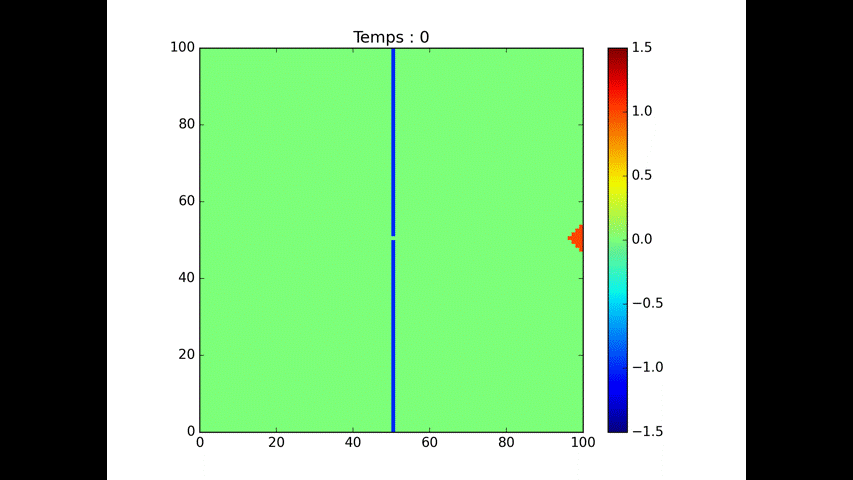
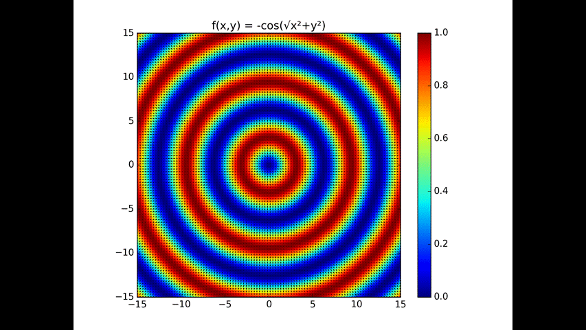

# Building Fire Propagation

Simulation d’incendie multi-étages avec propagation probabiliste, influence du vent et visualisation scientifique en Python.

---

## Aperçu

Ce dépôt contient un moteur de simulation (automate cellulaire 3D) simulant la propagation d’un incendie dans un bâtiment, avec prise en compte du vent, de la combustion des matériaux et de systèmes d’arrosage (sprinklers).

Le calcul utilise principalement `NumPy` et la visualisation `Matplotlib`.

---

## Structure du projet


Le code source est dans le dossier `src/`.

Arborescence principale :

```text
building-fire-propagation/
├─ README.md
├─ requirements.txt
├─ data/                 # jeux de données, configs exemples
├─ docs/                 # documentation projet
└─ src/
   ├─ main.py            # point d'entrée (configuration & lancement)
   ├─ simulation.py      # orchestrateur et boucle temporelle
   ├─ propagation.py     # règles de propagation du feu
   ├─ building.py        # génération et représentation du bâtiment
   ├─ wind.py            # génération et normalisation du champ de vent
   ├─ rendering.py       # animation / visualisation (Matplotlib)
   ├─ constants.py       # constantes et codage des états des cellules
   └─ utils.py           # utilitaires réutilisables
```

---

## Installation

1. Cloner le dépôt et se placer dans le dossier du projet :

```bash
git clone <repository_url>
cd building-fire-propagation
```

2. Créer et activer un environnement virtuel

Linux / macOS :

```bash
python -m venv venv
source venv/bin/activate
```

Windows (PowerShell) :

```powershell
python -m venv venv
venv\\Scripts\\Activate.ps1
```

3. Installer les dépendances

```bash
pip install -r requirements.txt
```

---

## Dépendances

Les dépendances principales sont listées dans `requirements.txt` :

- numpy
- matplotlib

---

## Exécuter la simulation

Lancer le script principal depuis la racine du projet :

```bash
python src\\main.py
```

Sur Linux/macOS utilisez `python3 src/main.py` si nécessaire.

---

## Exemple d'utilisation

Extrait d'utilisation : initialisation d’un bâtiment et exécution d’une simulation.

```python
from src.simulation import FireSimulation
from src.building import create_building

building = create_building(size=(48, 48), floors=5)

simulation = FireSimulation(
    building=building,
    wind_field=None,  # définir un champ de vent si souhaité
    ps=0.75,
    ph=0.075,
    combustion=0.025,
    sprinkler_flow=0
)

memory = simulation.run(120)
from src.rendering import animate
animate(memory)
```

---
## GIFs d'exemples

- **Building — Avec Alarme :**  
    

- **Building — Sans Alarme :**  
    

- **Obstacle — Porte :**  
    

- **Wind — Face à face :**  
    
 
- **Wind — Goutte :**  
    
 
- **Wind — 4 Vagues :**  
    
 
## États des cellules (valeurs utilisées)

| Valeur | Signification |
| ------ | ------------- |
| 0      | Zone inflammable |
| 0.5    | Inflammation |
| 1      | Feu actif |
| -0.25  | Structure |
| -0.5   | Zone mouillée |
| -0.75  | Zone brûlée mouillée |
| -1     | Mur |
| -1.5   | Zone brûlée |

---

## Vent

Le vent est représenté par un champ défini dans `src/wind.py`. Il peut être exprimé par une fonction scalaire 2D et normalisé en vecteur de direction.

Exemple simple :

```python
def wind_function(x, y):
    return np.sqrt(x**2 + y**2)
```

---

## Architecture (fichiers principaux)

- `src/building.py` : génération procédurale du bâtiment
- `src/propagation.py` : règles de propagation du feu
- `src/wind.py` : génération et normalisation du champ de vent
- `src/simulation.py` : boucle temporelle principale
- `src/rendering.py` : fonctions d'animation et d'affichage

---

## Paramètres importants

- `ps` : probabilité de propagation surfacique
- `ph` : probabilité de propagation verticale
- `combustion` : probabilité de combustion complète
- `sprinkler_flow` : intensité du système d'arrosage
- `steps` : nombre d'itérations temporelles

---

## Auteur

Projet de simulation scientifique et modélisation d’incendie.

---

## Licence

MIT License.