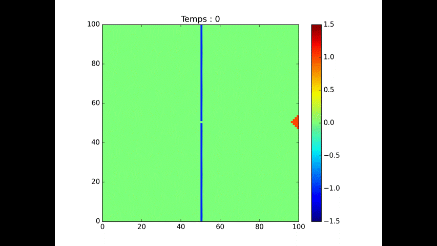
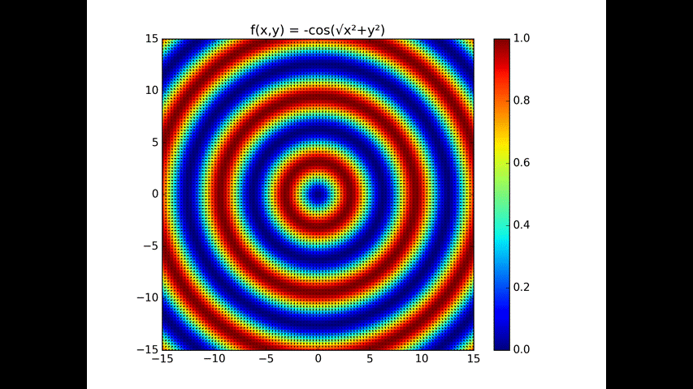

# Building Fire Propagation

Simulation d’incendie multi-étages avec propagation probabiliste, influence du vent et visualisation scientifique en Python.

---

## Aperçu

Ce dépôt contient un moteur de simulation (automate cellulaire 3D) simulant la propagation d’un incendie dans un bâtiment, avec prise en compte du vent, de la combustion des matériaux et de systèmes d’arrosage (sprinklers).

Voir les GIFs d’exemples dans la section [GIFs d'exemples](#gifs-dexemples).

Le calcul utilise principalement `NumPy` et la visualisation `Matplotlib`.

---

## Structure du projet


Le code source est dans le dossier `src/`.

Arborescence principale :

```text
building-fire-propagation/
├─ README.md
├─ pyproject.toml
├─ data/                 # jeux de données, configs exemples
├─ docs/                 # documentation projet
└─ src/
   ├─ config.py          # paramètres de la simulation
   ├─ main.py            # point d'entrée (configuration & lancement)
   └─ modules/           # modules de simulation
      ├─ building/       # génération du bâtiment
      │  └─ generation.py
      ├─ environment/    # environnement et vent
      │  └─ wind.py
      ├─ fire/           # propagation et simulation du feu
      │  ├─ propagation.py
      │  └─ simulation.py
      ├─ shared/         # constantes et utilitaires communs
      │  ├─ constants.py
      │  └─ utils.py
      └─ visualization/  # animation et affichage
         └─ rendering.py
```

---

## Installation

1. Cloner le dépôt et se placer dans le dossier du projet :

```bash
git clone <repository_url>
cd building-fire-propagation
```

2. Installer [`uv`](https://docs.astral.sh/uv/getting-started/installation/) si nécessaire,
puis synchroniser l’environnement du projet :

```bash
uv sync
```

---

## Dépendances

Les dépendances principales sont définies dans `pyproject.toml` :

- numpy
- matplotlib
- pillow

---

## Exécuter la simulation

La simulation démarre avec un foyer au centre de l’étage défini par
`INITIAL_FIRE_FLOOR` dans `src/config.py`. Le feu se propage selon les
probabilités surfacique et verticale, avec une influence du vent.

Lancer le script principal depuis la racine du projet. Une fenêtre affiche le GIF animé
généré en mémoire ; aucun fichier GIF n’est enregistré :

```bash
uv run python src/main.py
```

Les paramètres peuvent être ajustés au lancement. Par exemple :

```bash
uv run python src/main.py --floors 3 --steps 80 --initial-fire-floor 1 --ps 0.6 --ph 0.1 --combustion 0.03 --sprinkler-flow 5
```

Les valeurs par défaut sont définies dans `src/config.py` pour le nombre d’étages,
la durée et l’étage initial; les probabilités utilisent les valeurs par défaut de
`FireSimulation`. Les probabilités doivent être comprises entre `0` et `1`,
le nombre d’étages et les étapes doivent être positifs ou nuls, et l’étage
initial doit exister dans le bâtiment.

`uv run` utilise l’environnement créé et synchronisé par `uv sync`.

---

## Exemple d'utilisation

Extrait d'utilisation : initialisation d’un bâtiment et exécution d’une simulation.

```python
from modules.building.generation import create_building
from modules.fire.simulation import FireSimulation

building = create_building(size=(48, 48), floors=5)

simulation = FireSimulation(
    building=building,
    wind_field=None,  # définir un champ de vent si souhaité
    ps=0.75,
    ph=0.075,
    combustion=0.025,
    sprinkler_flow=0
)

memory = simulation.run(120)
from modules.visualization.rendering import animate
animate(memory)
```

---
## GIFs d'exemples

- **Building — Sans Alarme :**  
    

- **Building — Avec Alarme :**  
    

- **Obstacle — Porte :**  
    

- **Wind — Face à face :**  
    
 
- **Wind — Goutte :**  
    
 
- **Wind — 4 Vagues :**  
    
 
## États des cellules (valeurs utilisées)

| Valeur | Signification |
| ------ | ------------- |
| 0      | Zone inflammable |
| 0.5    | Inflammation |
| 1      | Feu actif |
| -0.25  | Surface inflammable |
| -0.5   | Zone mouillée |
| -0.75  | Zone brûlée mouillée |
| -1     | Mur |
| -1.5   | Zone brûlée |

---

## Vent

Le vent est représenté par un champ défini dans `src/wind.py`. Il peut être exprimé par une fonction scalaire 2D et normalisé en vecteur de direction.

Exemple simple :

```python
def wind_function(x, y):
    return np.sqrt(x**2 + y**2)
```

---

## Architecture

- `src/modules/building/` : génération du bâtiment
- `src/modules/fire/` : propagation et simulation du feu
- `src/modules/environment/` : calcul du champ de vent
- `src/modules/visualization/` : animation et affichage
- `src/modules/shared/` : constantes et fonctions utilitaires communes

---

## Paramètres importants

- `ps` : probabilité de propagation surfacique
- `ph` : probabilité de propagation verticale
- `combustion` : probabilité de combustion complète
- `sprinkler_flow` : intensité du système d'arrosage
- `steps` : nombre d'itérations temporelles
- `INITIAL_FIRE_FLOOR` : étage de départ du feu (au centre du bâtiment)

---

## Auteur

Projet de simulation scientifique et modélisation d’incendie.

---

## Licence

MIT License.